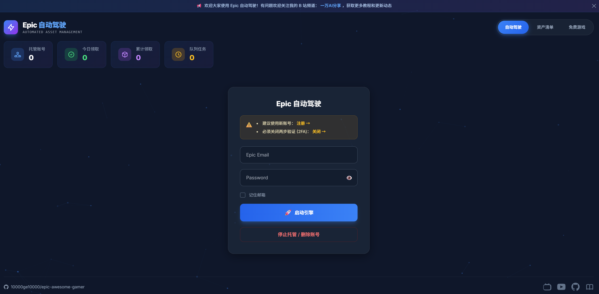

# Epic Kiosk - 自动领取系统


基于 Docker 和浏览器自动化的 Epic Games 免费游戏自动领取工具。当前 fork 在保留原版 Web / Docker 部署能力的基础上，重点增强了 GitHub Actions 自动领取、领取结果校验和运行结束通知。

> 原公益站点：[https://epic.910501.xyz/](https://epic.910501.xyz/)

<p align="center">
  
</p>

---

## 核心功能

| 功能 | 说明 |
|------|------|
| 自动领取 | 自动完成 Epic 登录、hCaptcha 处理、免费游戏领取与入库校验 |
| 多账号 | 支持 Web 后台添加账号，也支持 GitHub Actions 通过 Secret 批量运行 |
| Cookie 复用 | 首次登录后保存浏览器 profile，后续尽量复用会话状态 |
| AI 验证码 | 使用 OpenAI-compatible 视觉模型识别 hCaptcha |
| 严格校验 | 只有确认每个游戏已入库或已拥有时，才把账号标记为完成 |
| 运行通知 | GitHub Actions 运行结束后可通过 Server酱推送中文结果 |
| 排查证据 | Actions artifact 会保留日志、截图、页面快照和 `github_actions_summary.json` |

---

## GitHub Actions 自动领取

这是当前 fork 推荐的自动运行方式，不需要常驻 Web 后台。

定时任务由 `Epic Kiosk Claim` 触发。当前为临时验证配置：每周六北京时间 11:55 运行；验证通过后改回每周三、周五北京时间 08:23 和 20:23。也可以在 `Actions -> Epic Kiosk Claim -> Run workflow` 手动触发领取流程。

需要在仓库 `Settings -> Secrets and variables -> Actions` 配置：

- `API_BASE_URL`：OpenAI-compatible API 地址。
- `API_KEY`：API Key。
- `EPIC_ACCOUNTS_JSON`：Epic 账号列表。
- `SERVERCHAN_SENDKEY`：可选，配置后运行结束会通过 Server酱推送中文结果。

`EPIC_ACCOUNTS_JSON` 示例：

```json
[
  {
    "email": "account@example.com",
    "password": "your-password"
  }
]
```

当前 workflow 使用：

```env
API_PROVIDER=openai_compatible
PRIMARY_MODEL=agnes-2.0-flash
PRIMARY_MODEL_FALLBACK=agnes-2.0-flash
CAPTCHA_MODEL=agnes-2.0-flash
CAPTCHA_MODEL_FALLBACK=agnes-2.0-flash
```

运行说明：

- 每个账号最多重试 `EPIC_ACCOUNT_MAX_ATTEMPTS` 次，默认 3 次。
- 每次账号重试都会启动新的浏览器进程。
- 只有检测到所有免费游戏都已拥有或已入库，账号才会被标记为完成。
- `app/volumes` 会通过 GitHub cache 保存，减少重复登录。
- 日志、截图、页面快照和 `github_actions_summary.json` 会作为 artifact 保留 14 天。

---

## Docker 部署

### Linux 一键部署

适用于 VPS、云服务器或 Linux 主机：

```bash
curl -fsSL https://raw.githubusercontent.com/10000ge10000/epic-kiosk/main/install.sh | bash
```

脚本会安装 Docker / Docker Compose，拉取项目并引导配置 API Key。

### 手动部署

```bash
git clone https://github.com/10000ge10000/epic-kiosk.git
cd epic-kiosk
cp .env.example .env
nano .env
docker compose up -d --build
```

`.env` 示例：

```env
API_PROVIDER=openai_compatible
API_BASE_URL=https://api.example.com/v1
API_KEY=sk-xxxxxxxxxxxxxxxxxxxxxxxxxxxxxxxx
PRIMARY_MODEL=agnes-2.0-flash
PRIMARY_MODEL_FALLBACK=agnes-2.0-flash
CAPTCHA_MODEL=agnes-2.0-flash
CAPTCHA_MODEL_FALLBACK=agnes-2.0-flash
```

部署注意：

- 默认 Web 端口是 `18000`。
- `.env` 已被 `.gitignore` 忽略，不要把真实 key 写进 Git 跟踪文件。
- 验证码模型必须支持图片输入。
- WARP 容器仍保留在 Docker 部署中；如果 Epic 风控严重，可能需要更稳定的代理出口。

---

## Web 后台使用

### 添加账号

1. 输入 Epic 邮箱和密码。
2. 点击启动引擎。
3. 系统会自动处理登录、验证码和免费游戏领取。

### 查看资产

- 在资产清单中查看已领取游戏。
- 点击游戏封面可跳转 Epic 商店。

### 删除账号

- 输入密码后点击删除。
- 系统会清理数据库记录和本地 Cookie 数据。

---

## 配置说明

### AI 模型

| 类型 | 主模型 | 备用模型 | 用途 |
|------|--------|----------|------|
| 文本 | `agnes-2.0-flash` | `agnes-2.0-flash` | 页面判断、流程决策、结构化文本输出 |
| 视觉 | `agnes-2.0-flash` | `agnes-2.0-flash` | hCaptcha 图像识别 |

相关环境变量：

```env
API_PROVIDER=openai_compatible
API_BASE_URL=https://api.example.com/v1
API_KEY=sk-xxxxxxxxxxxxxxxxxxxxxxxxxxxxxxxx
PRIMARY_MODEL=agnes-2.0-flash
PRIMARY_MODEL_FALLBACK=agnes-2.0-flash
CAPTCHA_MODEL=agnes-2.0-flash
CAPTCHA_MODEL_FALLBACK=agnes-2.0-flash
RESPONSE_TIMEOUT=120
```

API 额度和价格以所选服务商当前账号页面为准。不同账号、地区、模型和活动政策可能不同，部署前应确认可用额度。

---

## 项目结构

```text
epic-kiosk/
├── app/                         # 核心代码
│   ├── deploy.py                # 浏览器自动化入口
│   ├── services/                # Epic 登录和领取逻辑
│   └── settings.py              # 模型/API 配置与 OpenAI-compatible 补丁
├── .github/workflows/           # GitHub Actions 自动领取和网络诊断
├── scripts/
│   ├── github_actions_claim_once.py
│   └── serverchan_notify.py
├── templates/                   # Web 前端
├── docker-compose.yml
├── Dockerfile
└── Dockerfile.worker
```

---

## 故障排查

**Q: 日志提示 `未配置 API_KEY`？**

A: 检查 `.env` 或 GitHub Secret 是否存在 `API_KEY`。

**Q: OpenAI-compatible API 返回 401 / 403？**

A: key 无效、过期、权限不足或账号额度不可用。登录对应 API 服务商控制台检查 Key、额度和模型权限。

**Q: OpenAI-compatible API 返回 404？**

A: 通常是模型 ID 不存在、接口路径不兼容，或该账号无权使用该模型。先确认 `API_BASE_URL` 和模型名。

**Q: 验证码一直失败？**

A: 先检查日志里是否有 API 错误；如果没有，重点排查 Epic 风控、代理出口和验证码类型变化。

**Q: GitHub Actions 显示完成但账号漏领？**

A: 当前 workflow 会基于入库证据严格判断。请下载 artifact，查看 `github_actions_summary.json`、截图和页面快照。

---

## 版本升级

```bash
git pull
docker compose up -d --build
```

仅升级 Worker：

```bash
docker compose build worker && docker compose up -d worker
```

---

## 相关文档

- [GitHub Actions 自动领取](docs/GITHUB_ACTIONS.md)
- [快速开始指南](docs/QUICKSTART.md)
- [模型配置说明](docs/MODEL_CONFIG.md)

> 注意：部分旧文档可能仍保留历史 SiliconFlow 配置说明，当前 README、`.env.example` 和 GitHub Actions workflow 以 OpenAI-compatible 配置为准。

---

## 致谢

- 原项目：[QIN2DIM/epic-awesome-gamer](https://github.com/QIN2DIM/epic-awesome-gamer)
- 当前 fork 基于 [10000ge10000/epic-kiosk](https://github.com/10000ge10000/epic-kiosk) 调整

---

## 免责声明

本项目仅供学习和技术研究使用。请合理使用，遵守 Epic Games 服务条款。开发者不对因使用本项目导致的任何损失承担责任。
